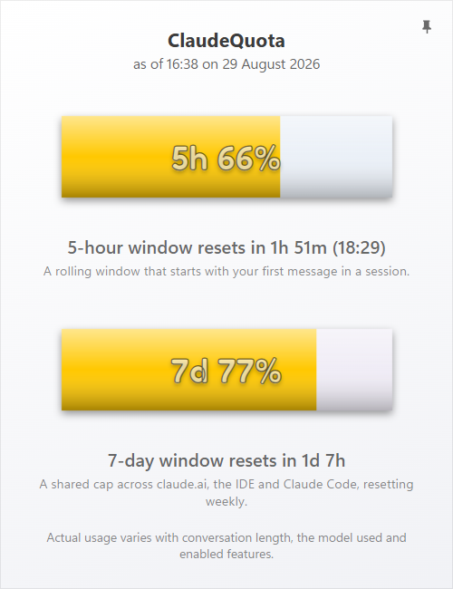
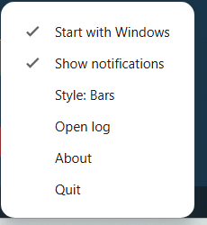
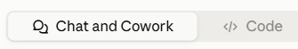

#  ClaudeQuota

A Windows tray app that shows your Claude usage limits at a glance, in either of two styles:

- **Horizontal bars** (default): two fill bars, one for the 5-hour window and one for the 7-day window.
- **Vertical bars**: the same two values as vertical columns side by side, left for the 5-hour window, right for the 7-day one.

- **Hover** the icon to see the exact percentages and reset times in the tooltip.
- **Left-click** the icon to open a small popup with an enlarged, more detailed view of the same bars/columns, matching whichever display style is currently selected.

<picture>
  <source media="(prefers-color-scheme: dark)" srcset="docs/popup-dark.png">
  
</picture>

Pin the popup open (top-right button) to keep it visible instead of closing when it loses focus, and click Minimize (appears next to Pin once pinned) to shrink it down to just the two bars and their reset time - a lightweight, more transparent readout for keeping an eye on fast-changing usage during a long session without it getting in the way.

- **Right-click** the icon for the tray menu: start with Windows (on by default after install, toggleable), show notifications (on by default, toggleable), display style (switches between horizontal and vertical bars, remembered across restarts), open log, about, and quit.

<picture>
  <source media="(prefers-color-scheme: dark)" srcset="docs/tray-menu-dark.png">
  
</picture>

Each bar's empty ("track") color is fixed and just identifies which one is which - blue for the 5-hour window, purple for the 7-day one - it doesn't change with usage. The filled part is colored by how close that window is to its limit: green at 50% and under, amber from 51% to 80%, red at 81% and above. Both use the same thresholds, and a thin outline keeps each bar visible even near empty.

You'll also get a Windows notification the first time a window's usage passes 51%, 81%, 99%, and 100% - the last one also says when that window resets. Each one shows the app icon plus a small preview of that bar, and clicking it opens the popup. Nothing fires retroactively: usage already past a threshold when the app starts doesn't trigger a notification for it.

All of these colors, plus the icon itself, follow your Windows light/dark theme and redraw immediately if you switch it - no restart needed.

| | Light theme | Dark theme |
|---|---|---|
| 5-hour track |  `#78A0D2` (12% opacity) |  `#64A5FF` (8% opacity) |
| 7-day track |  `#C3A5DC` (12% opacity) |  `#C89BFF` (8% opacity) |
| Fill, 0-50% |  `#00C800` |  `#00C800` |
| Fill, 51-80% |  `#FFC800` |  `#FFC800` |
| Fill, 81-100% |  `#E00000` |  `#FF3B30` |

## How it works

The app reads the OAuth token that the Claude Code CLI already saved locally (`~/.claude/.credentials.json`) and polls the undocumented `GET https://api.anthropic.com/api/oauth/usage` endpoint, which returns the current `five_hour` and `seven_day` limit utilization. No data goes anywhere except `api.anthropic.com`.

Since the endpoint is undocumented and the access token lives for about an hour, the app:

- polls the usage endpoint no more than once every 180 seconds (a limit enforced by the token itself, not an arbitrary choice);
- proactively refreshes the access token via the refresh token before it expires;
- never writes to the CLI's own credentials file - a refreshed token is kept in a separate private cache instead, and whichever of the two (CLI file or private cache) has the newer token wins on the next check.

## Requirements

- Windows 10/11.
- Claude Code CLI installed and logged in (`claude login`).

> **Not seeing any numbers?** ClaudeQuota reads your usage from a local login file that only Claude Desktop's **Code** tab or the Claude Code CLI create - not from claude.ai itself.
>
> - **Using Claude Desktop?** Switch to the **Code** tab (top of the window, next to *Chat and Cowork*). Just opening it isn't enough - type anything in the box at the bottom (even just "hi") and press Enter to actually start a session, since that's the step that creates the login file. You can switch straight back to Chat afterward - you won't need Code again.
>
>   
> - **Using claude.ai in a browser only?** That won't work with ClaudeQuota, and can't be made to - a browser has no access to your PC's files. Install [Claude Desktop](https://claude.ai/download) instead, sign in once through its Code tab, and ClaudeQuota will pick it up automatically.
>
> Tray icon nowhere to be found either way? Windows sometimes hides new tray icons - click the little **^** arrow near the clock to check.

## License

[MIT](LICENSE).

Bundles the [Fredoka](https://fonts.google.com/specimen/Fredoka) font (SIL Open Font License, see `assets/fonts/OFL.txt`).
