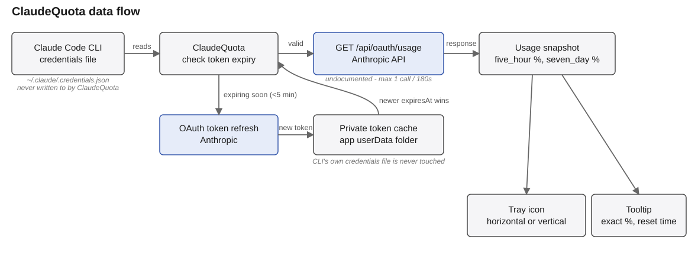

#  ClaudeQuota

A Windows tray app that shows your Claude usage limits at a glance: two fill bars in the tray icon, one for the 5-hour window and one for the 7-day window. Hovering the icon shows the exact percentages and reset times.

Each bar's empty ("track") color is fixed and just identifies which bar is which - blue for the 5-hour window, purple for the 7-day one - it doesn't change with usage. The filled part is colored by how close that window is to its limit: green below 70%, amber from 70% up to 90%, red at 90% and above. Both bars use the same thresholds.

## How it works

The app reads the OAuth token that the Claude Code CLI already saved locally (`~/.claude/.credentials.json`) and polls the undocumented `GET https://api.anthropic.com/api/oauth/usage` endpoint, which returns the current `five_hour` and `seven_day` limit utilization. No data goes anywhere except `api.anthropic.com`.

Since the endpoint is undocumented and the access token lives for about an hour, the app:

- polls the usage endpoint no more than once every 180 seconds (a limit enforced by the token itself, not an arbitrary choice);
- proactively refreshes the access token via the refresh token before it expires;
- never writes to the CLI's own credentials file - a refreshed token is kept in a separate private cache instead, and whichever of the two (CLI file or private cache) has the newer token wins on the next check.

## Requirements

- Windows 10/11.
- Claude Code CLI installed and logged in (`claude login`).

## Tray menu

Right-clicking the icon shows exactly three items: start with Windows (on by default after install, toggleable), about, and quit.

## Status

Under active development. macOS is not supported.
