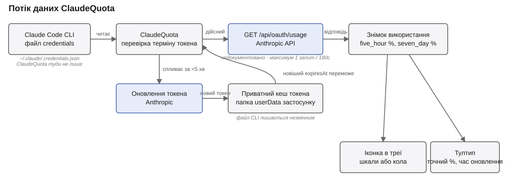

#  ClaudeQuota

Трей-застосунок для Windows, який показує використання лімітів Claude одним поглядом - у будь-якому з двох стилів:

- **Горизонтальні шкали** (за замовчуванням): дві шкали заповнення - одна для 5-годинного вікна, друга для тижневого.
- **Вертикальні шкали**: ті самі два значення у вигляді вертикальних стовпчиків поруч - лівий для 5-годинного вікна, правий для тижневого.

- **Наведення** на іконку показує точний відсоток і час оновлення у тултипі.
- **Лівий клік** на іконці відкриває невелике вікно зі збільшеним, детальнішим виглядом тих самих шкал - відповідно до поточного обраного стилю відображення.
- **Правий клік** на іконці відкриває меню трею: запуск разом із Windows (увімкнено за замовчуванням після встановлення, можна перемкнути), показувати сповіщення (увімкнено за замовчуванням, можна перемкнути), стиль відображення (перемикає горизонтальні/вертикальні шкали, зберігається між запусками), відкрити лог, про програму, вихід.

Колір "порожньої" частини кожної шкали фіксований і лише позначає, яке це вікно - синій для 5-годинного, фіолетовий для тижневого - він не змінюється залежно від використання. Колір заповненої частини залежить від того, наскільки близько це вікно до свого ліміту: зелений до 50%, жовтий від 51% до 80%, червоний від 81% і вище. Пороги однакові для обох, а тонка обвідна лінія тримає кожну шкалу помітною навіть майже порожньою.

Також ви отримаєте сповіщення Windows першого разу, коли використання вікна перевищить 51%, 81% і 99% - кожне з іконкою застосунку та мініатюрою відповідної шкали, клік по ньому відкриває попап. Нічого не спрацьовує заднім числом: використання, що вже перевищило порог на момент запуску застосунку, не викликає сповіщення про нього.

Усі ці кольори, як і сама іконка, підлаштовуються під світлу чи темну тему Windows і перемальовуються миттєво при зміні теми - без перезапуску застосунку.

| | Світла тема | Темна тема |
|---|---|---|
| Трек 5-годинного вікна |  `#78A0D2` (12% прозорості) |  `#64A5FF` (8% прозорості) |
| Трек тижневого вікна |  `#C3A5DC` (12% прозорості) |  `#C89BFF` (8% прозорості) |
| Заповнення, 0-50% |  `#00C800` |  `#00C800` |
| Заповнення, 51-80% |  `#FFC800` |  `#FFC800` |
| Заповнення, 81-100% |  `#E00000` |  `#FF3B30` |

## Як це працює

Застосунок читає OAuth токен, який уже зберігає локально Claude Code CLI (`~/.claude/.credentials.json`), і опитує недокументований ендпоінт `GET https://api.anthropic.com/api/oauth/usage`, який повертає поточне використання 5-годинного (`five_hour`) і тижневого (`seven_day`) лімітів. Дані не передаються нікуди, окрім `api.anthropic.com`.

Оскільки ендпоінт недокументований, а access token живе приблизно годину, застосунок:

- опитує API не частіше ніж раз на 180 секунд (це межа, яку застосовує сам токен, а не довільний вибір);
- проактивно оновлює access token через refresh token до завершення його дії;
- ніколи не пише у файл credentials, яким керує сам Claude Code CLI - оновлений токен зберігається в окремому приватному кеші, і при наступній перевірці переможе новіший з двох (файл CLI чи приватний кеш).

## Вимоги

- Windows 10/11.
- Встановлений і авторизований Claude Code CLI (`claude login`).

## Ліцензія

[MIT](LICENSE).
